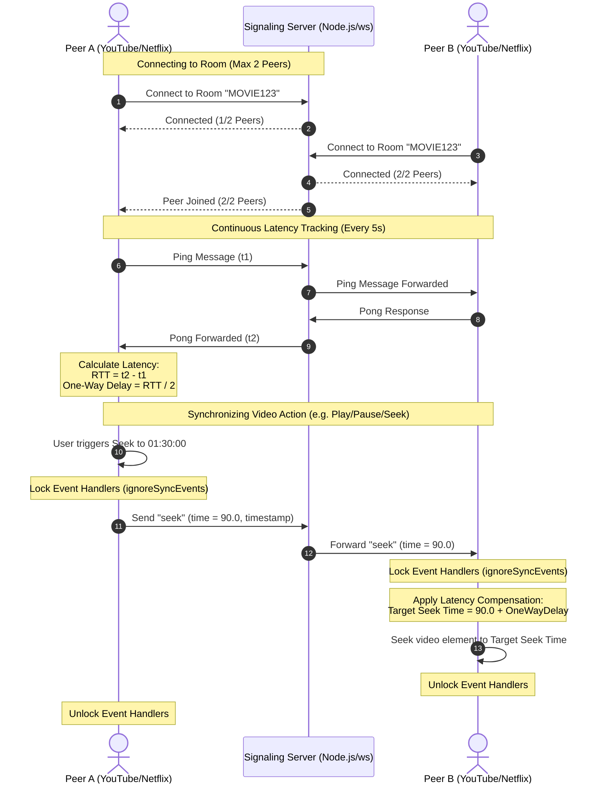

# 🎬 Remote Video Synchronizer (RVS)

[](https://developer.chrome.com/docs/extensions/mv3/intro/)
[](https://github.com/websockets/ws)
[](#-security--safety-guidelines)
[](LICENSE)

A premium, high-performance, real-time **Chrome Extension & Signaling Server** that synchronizes video playback, seek times, and speed between remote users on **YouTube** and **Netflix**. Engineered with **State Lock Synchronization** and **Latency-Compensated Seeking** to guarantee frame-accurate sync regardless of network delay.

---

## 🗺️ System Architecture

RVS has two components:

- **Chrome extension** (`extension/`) — injected into YouTube/Netflix tabs to
  capture local video events and apply remote sync commands.
- **Signaling server** (`server.js`) — a lightweight Node.js WebSocket relay that
  routes messages between exactly two peers per room.

Inside the extension, the WebSocket is **owned by the background service worker**
(`background.js`), not the content script. This matters for two reasons: Netflix's
page Content Security Policy blocks `wss://` connections opened from a content
script, and the open port from `content.js` keeps the MV3 service worker alive for
the tab's lifetime. The content script captures local `<video>` events and applies
remote commands; on Netflix, writes go through a MAIN-world bridge
(`netflix-bridge.js`) that drives the official player API to avoid tamper detection
(error **M7375**) instead of touching the `<video>` element directly.

The sequence below shows how two peers connect, track latency, and synchronize a
video action:



---

## ✨ Features

- **Two-peer rooms**: Each room holds a maximum of two peers, keeping bandwidth and
  synchronization simple and predictable.
- **Latency compensation**: A periodic ping/pong measures round-trip time; `play`
  and `seek` targets are offset by the estimated one-way delay so both players land
  at the same point.
- **State lock (anti-feedback)**: Programmatically applied commands are flagged so
  the resulting `play`/`pause`/`seeked` events aren't re-broadcast back to the peer.
- **Netflix support without tamper detection**: A MAIN-world bridge drives Netflix's
  official player API, avoiding the M7375 error caused by writing to the `<video>`
  element directly. YouTube uses the direct path.
- **SPA resilience**: A `MutationObserver` hooks into the `<video>` element once the
  single-page app injects it, and re-binds if it's replaced.
- **Connect/Disconnect toggle**: The popup connects or cleanly disconnects from a
  room, with a randomized Room ID generator, copy/paste shortcuts, and live status,
  peer-count, and RTT readouts.

---

## 📁 Repository Structure

| Path | Purpose |
| :--- | :--- |
| [`extension/`](extension/) | The packaged Chrome extension (Manifest V3). |
| ├── [`manifest.json`](extension/manifest.json) | Extension config: permissions (`activeTab`, `storage`, `clipboardRead`) and YouTube/Netflix host matches. |
| ├── [`config.js`](extension/config.js) | Single point of configuration for the WebSocket server URL. |
| ├── [`background.js`](extension/background.js) | Service worker that owns the WebSocket, per-tab state, the latency ping loop, and the colored toolbar icon. |
| ├── [`content.js`](extension/content.js) | Captures local video events and applies remote commands; manages the state lock and talks to `background.js` over a port. |
| ├── [`netflix-bridge.js`](extension/netflix-bridge.js) | MAIN-world script that drives Netflix's player API to apply commands without triggering M7375. |
| ├── [`popup.html`](extension/popup.html) | Dark-themed popup UI. |
| └── [`popup.js`](extension/popup.js) | Popup controller: room lifecycle, connect/disconnect, copy/paste, and status polling. |
| [`server.js`](server.js) | Node.js WebSocket signaling server; relays between two peers per room. Reads `PORT`/`HOST` env vars. |
| [`docs/`](docs/) | Project documentation. |
| ├── [`deployment_plan.md`](docs/deployment_plan.md) | Production deployment guide (TLS/WSS, reverse proxy, systemd). |
| ├── [`implementation_plan.md`](docs/implementation_plan.md) | Implementation notes and design decisions. |
| └── [`walkthrough.md`](docs/walkthrough.md) | Verification walkthrough with operational tests. |
| [`task.md`](task.md) | Development milestones and verification checklist. |
| [`PRIVACY_POLICY.md`](PRIVACY_POLICY.md) | Privacy policy for the published extension. |

---

## 🚀 Getting Started

Run the full system locally in a few steps.

### 1. Prerequisites

Install [Node.js](https://nodejs.org/) (v16+).

### 2. Set up and start the signaling server

1. Install dependencies:
   ```bash
   npm install
   ```
2. Start the local server:
   ```bash
   npm start
   ```
   The terminal will print:
   `Remote Video Synchronizer (RVS) Signaling Server running on ws://127.0.0.1:8080`

> For local development the extension must point at this server. Set
> `WS_SERVER_URL` in [`extension/config.js`](extension/config.js) to
> `ws://127.0.0.1:8080`. Production uses `wss://` (see
> [Production Deployment](#-production-deployment)).

### 3. Load the extension in Chrome

1. Open `chrome://extensions/`.
2. Enable **Developer mode** (top-right toggle).
3. Click **Load unpacked** and select the `extension/` directory.

---

## 🎮 How to Test and Use

To verify synchronization between two parties (or test locally with side-by-side
tabs):

1. **Open two tabs** and navigate to the same YouTube or Netflix video in both.
2. **In Tab 1**, open the extension popup:
   - Click **Generate** to create a Room ID, then **Copy** it.
   - Click **Connect**. Status goes to `Connecting` and then `Connected`.
3. **In Tab 2**, open the extension popup:
   - Click **Paste** to fill in the Room ID.
   - Click **Connect**. Status shows `Connected` with `2 / 2` peers.
4. Play, pause, change playback speed, or scrub in either tab — the other follows.
5. Click **Disconnect** in either tab to leave the room cleanly.

---

## 🔒 Security & Safety Guidelines

- **No `innerHTML`**: DOM updates use `textContent` and `createElement`, avoiding a
  common XSS vector.
- **Local-only by default**: The signaling server binds to `127.0.0.1:8080` unless
  `HOST` is set, so it isn't exposed externally during local testing.
- **Graceful fallbacks**: If the browser blocks clipboard access, the popup falls
  back to a console warning and a user prompt instead of failing silently.

---

## 🚢 Production Deployment

Before serving external users, review the full
[Deployment Plan](docs/deployment_plan.md).

> [!IMPORTANT]
> **HTTPS/WSS requirement**: On HTTPS pages like YouTube and Netflix, Chrome blocks
> insecure WebSocket (`ws://`) connections. For production you must terminate TLS and
> connect via `wss://`, typically through a reverse proxy (e.g. Caddy or Nginx). The
> server itself does not handle TLS. Avoid serverless platforms — they don't support
> persistent WebSocket connections.

---

## 📄 License

This project is licensed under the MIT License — see the [LICENSE](LICENSE) file for
details.
