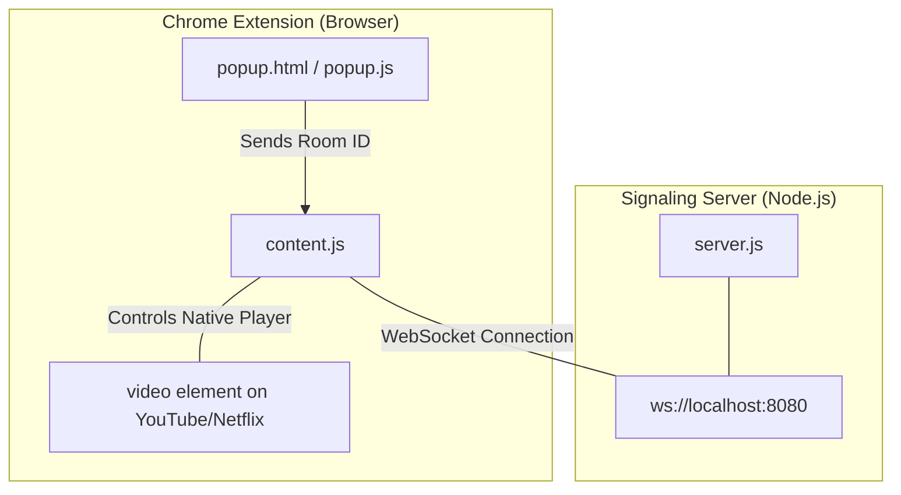

# Implementation Plan - Remote Video Synchronizer (RVS)

A lightweight Chrome Extension prototype (Manifest V3) and minimal WebSocket backend designed to synchronize playback time, play/pause state, and speed of native video players on **YouTube** and **Netflix** in real time for two remote users.

## User Review Required

Please review the simplified, extension-focused architecture below.

> [!IMPORTANT]
> **Key Architecture Decisions:**
> 1. **Chrome Extension Form Factor**: Consists of a simple popup (to join a room) and a content script that injects directly into YouTube or Netflix tabs to capture and control the native `<video>` elements.
> 2. **WebSocket Signaling Server**: A minimal Node.js server (`server.js`) that matches and relays playback events between two users sharing a Room ID.
> 3. **Minimal State Locking**: To prevent infinite feedback loops, we implement a simple boolean flag (`ignoreSyncEvents`) in the content script that temporarily disables outgoing WebSocket events when applying remote commands.
> 4. **Native Dialogs**: As requested for MVP simplicity, the extension popup and content script will use native browser dialogues (`alert`, `prompt`) to request Room IDs or show connection states.
> 
> TODO(security): Replace native alerts and prompt dialogues with styled DOM modals before graduating to production.

---

## Proposed Changes

We will create a clean, simple project structure inside the workspace (`/home/levil/rvs`):
- `/extension`: The Chrome Extension files.
- `server.js` & `package.json`: The signaling backend.

### 1. Signaling Backend

A minimal server to pair two WebSocket connections matching the same Room ID and relay event payloads.

#### [NEW] [package.json](file:///home/levil/rvs/package.json)
- Declares dependencies: `"ws": "^8.17.0"`.
- Simple start script: `"start": "node server.js"`.

#### [NEW] [server.js](file:///home/levil/rvs/server.js)
- Runs a WebSocket server on `127.0.0.1:8080`.
- Manages rooms. When a user connects and joins a room, they are stored.
- Supports exactly two users per room.
- Relays sync messages (`play`, `pause`, `seek`, `rate`) directly to the peer in the same room.
- Relays latency ping/pong payloads between peers to enable direct P2P RTT measurements.

---

### 2. Chrome Extension

A standard Chrome Extension that interacts directly with active tabs.

#### [NEW] [/extension/manifest.json](file:///home/levil/rvs/extension/manifest.json)
- Standard Manifest V3 structure.
- Requests permissions: `activeTab`, `storage`, `clipboardRead`.
- Specifies host permissions for matching sites:
  - `*://*.youtube.com/*`
  - `*://*.netflix.com/*`
- Defines the `popup.html` action and declares `content.js` as an injectable content script.

#### [NEW] [/extension/popup.html](file:///home/levil/rvs/extension/popup.html)
- Extremely simple popup UI.
- Contains:
  - A small header ("Video Sync Prototype").
  - An input text box for Room ID.
  - A "Connect / Join Room" button.
  - Current connection state and measured peer-to-peer latency displays.

#### [NEW] [/extension/popup.js](file:///home/levil/rvs/extension/popup.js)
- Retrieves the active tab and sends a message to the content script (`content.js`) containing the Room ID when the user clicks the button.
- Saves/reads the Room ID to Chrome storage for persistence.

#### [NEW] [/extension/content.js](file:///home/levil/rvs/extension/content.js)
- Automatically injected when on YouTube or Netflix.
- Listens for messages from `popup.js` to trigger a connection to the WebSocket server.
- Locates the native player: `const video = document.querySelector('video')`.
- Adds simple native listeners on `video`:
  - `play`: Send `{ action: 'play', time: video.currentTime }` to WebSocket.
  - `pause`: Send `{ action: 'pause', time: video.currentTime }` to WebSocket.
  - `seeked`: Send `{ action: 'seek', time: video.currentTime }` to WebSocket.
  - `ratechange`: Send `{ action: 'rate', rate: video.playbackRate }` to WebSocket.
- **Latency Calibration & Measurement**:
  - Periodically (e.g. every 5 seconds) sends a `p2p_ping` message to the other client containing a timestamp.
  - When receiving `p2p_ping`, responds immediately with `p2p_pong` echoing the original timestamp.
  - Upon receiving `p2p_pong`, calculates the Round-Trip Time (`RTT = Date.now() - timestamp`) and updates the estimated one-way peer-to-peer latency (`one_way_latency = RTT / 2`).
  - Logs the measured latency to the browser console and updates any UI text.
- **Latency-Compensated Sync Actions**:
  - Sets `ignoreSyncEvents = true`.
  - When receiving a remote `play` or `seek` event, compensates for the transit time:
    - `targetTime = event.time + (one_way_latency / 1000)` (adjusting from milliseconds to seconds).
    - Performs the programmatic action: `video.currentTime = targetTime; video.play()`.
  - Resets `ignoreSyncEvents = false` after a small delay (e.g., 250ms) to ensure native event loops finish executing.

---

## Verification Plan

We will perform direct local verification using Chrome loaded from the filesystem.

### Automated Server & Port Verification
- Start the server on `127.0.0.1:8080`.
- Verify the server binds correctly and runs locally.

### Manual Verification
1. Open Chrome and go to `chrome://extensions`.
2. Enable "Developer mode" and click "Load unpacked", pointing to the `/extension` directory.
3. Open two separate Chrome browser windows or tabs side-by-side:
   - Tab 1: YouTube video (e.g. open source blender video).
   - Tab 2: Same YouTube video (same URL).
4. Click the extension popup in Tab 1, enter room `ROOM123`, and click join.
5. Click the extension popup in Tab 2, enter room `ROOM123`, and click join.
6. Play, pause, seek, and change speed on Tab 1, verifying that Tab 2 updates instantly and does not cause a feedback stutter.
7. Repeat action from Tab 2 to Tab 1.

### Security Review Plan
- **Sanitization**: Ensure incoming Room IDs are checked for format safety before sending.
- **Port Binding**: Ensure server binds to `127.0.0.1:8080` to prevent exposure.
