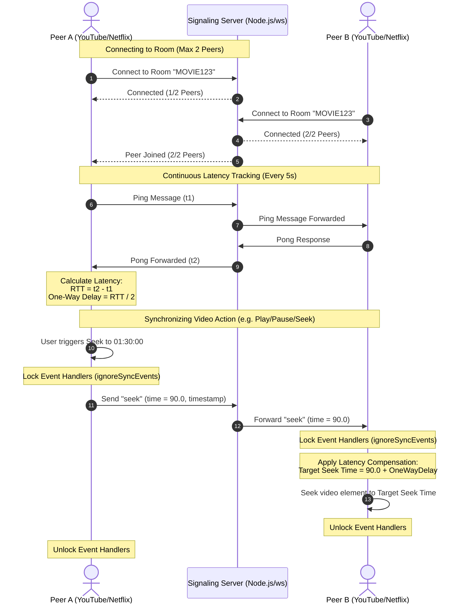
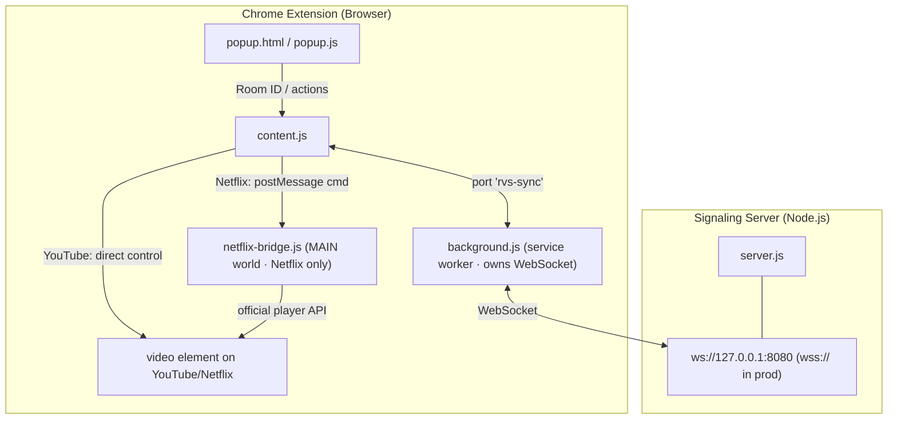

# Implementation & Architecture - Remote Video Synchronizer (RVS)

A lightweight Chrome Extension (Manifest V3) and a minimal WebSocket backend that
synchronize playback time, play/pause state, and speed of the native video
players on **YouTube** and **Netflix** in real time between two remote users.

This document is the design reference: the high-level architecture, the message
flow between components, and the per-file responsibilities. For local setup see
the [README](../README.md); for shipping to production see the
[Deployment Plan](deployment_plan.md).

---

## System Architecture

RVS has two components:

- **Chrome extension** (`extension/`) — injected into YouTube/Netflix tabs to
  capture local video events and apply remote sync commands.
- **Signaling server** (`server.js`) — a lightweight Node.js WebSocket relay that
  routes messages between exactly two peers per room.

Inside the extension, the WebSocket is **owned by the background service worker**
(`background.js`), not the content script. This matters for two reasons: Netflix's
page Content Security Policy blocks `wss://` connections opened from a content
script, and the open port from `content.js` keeps the MV3 service worker alive for
the tab's lifetime. The content script captures local `<video>` events and applies
remote commands; on Netflix, writes go through a MAIN-world bridge
(`netflix-bridge.js`) that drives the official player API to avoid tamper detection
(error **M7375**) instead of touching the `<video>` element directly.

### Message Flow

```
popup.js ──sendMessage──> content.js ──port──> background.js ──WebSocket──> server.js ──> (peer) background.js ──port──> content.js
```

### Peer Sync Sequence

The sequence below shows how two peers connect, track latency, and synchronize a
video action:



### Component Diagram



---

## Component Design

### 1. Signaling Backend

A minimal server that pairs two WebSocket connections sharing a Room ID and relays
event payloads between them.

#### [`package.json`](../package.json)
- Declares the runtime dependency `ws`.
- Start script: `npm start` → `node server.js`.

#### [`server.js`](../server.js)
- Runs a WebSocket server, binding to `127.0.0.1:8080` by default (`HOST`/`PORT`
  env vars override for production).
- Holds rooms in-memory as a `Map<roomId, WebSocket[]>`, **max 2 peers per room**.
- On `join`, registers the socket in its room; blindly relays every other packet
  (`play`, `pause`, `seek`, `rate`, `p2p_ping`, `p2p_pong`) to the peer.
- Cleans up on disconnect and notifies the remaining peer.

### 2. Chrome Extension

#### [`extension/manifest.json`](../extension/manifest.json)
- Manifest V3. Requests `activeTab`, `storage`, and `clipboardRead` permissions.
- Host permissions scoped to `*://*.youtube.com/*` and `*://*.netflix.com/*`.
- Registers the popup action, the `content.js` content script, and the
  Netflix-only MAIN-world `netflix-bridge.js`.
- The `version` field is the **single source of truth for releases** — see
  [CONTRIBUTION.md](../CONTRIBUTION.md#4-versioning--releasing).

#### [`extension/config.js`](../extension/config.js)
- Single point of configuration: `WS_SERVER_URL`. `ws://127.0.0.1:8080` for local
  dev, `wss://your-domain` for production. Loaded by `background.js` via
  `importScripts`.

#### [`extension/popup.html`](../extension/popup.html) / [`extension/popup.js`](../extension/popup.js)
- Dark-themed popup UI. Provides a Room ID input with **Generate** (random
  6-character ID), **Copy**, and **Paste** helpers, a Connect/Disconnect toggle,
  and live status / peer-count / RTT readouts.
- Talks to `content.js` via `chrome.runtime` messaging (`CONNECT`, `GET_STATUS`)
  and persists the Room ID to `chrome.storage`.

#### [`extension/background.js`](../extension/background.js)
- The **service worker that owns the WebSocket.** Holds per-tab state in a
  `Map<tabId, state>`, connects to `WS_SERVER_URL`, runs the 5-second latency ping
  loop, and relays sync packets between the content-script port and the server.
- Emits `latency_update` to the port after each `p2p_pong` and renders the colored
  toolbar icon (red/yellow/green) via `OffscreenCanvas`.

#### [`extension/content.js`](../extension/content.js)
- Injected on YouTube and Netflix. Finds the `<video>` element via a
  `MutationObserver` (the SPA injects it ~1–2s after load) and re-binds if replaced.
- Captures native `play` / `pause` / `seeked` / `ratechange` events and forwards
  them over the `rvs-sync` port; applies remote commands received over the port.
- **YouTube** uses the direct path (`video.currentTime`, `video.play()`).
- **Netflix** posts commands to `netflix-bridge.js` via `window.postMessage`
  (`{ __rvs: 'cmd', ... }`) and waits for the bridge's `ack`.

#### [`extension/netflix-bridge.js`](../extension/netflix-bridge.js)
- Runs in the page's **MAIN world** (Netflix only) so it can reach
  `window.netflix.appContext.state.playerApp.getAPI().videoPlayer`.
- Drives the official player API (`play` / `pause` / `seek` / `setPlaybackRate`)
  and acks back (`{ __rvs: 'ack', ok, reason }`), avoiding the M7375 tamper error
  that direct `<video>` writes trigger on Netflix.

---

## Sync Mechanics

### State Lock (Anti-Feedback)
Before applying a remote command, `content.js` sets `ignoreSyncEvents = true` so
the resulting programmatic `play`/`pause`/`seeked` event isn't re-broadcast back to
the peer. On the YouTube/direct path the lock releases after 250ms via
`setTimeout`. On the Netflix/bridge path it releases ~300ms after the bridge's
`ack` (with a 4.5s safety-net timeout), since the bridge applies commands
asynchronously.

### Latency Compensation
One-way latency is estimated as `RTT / 2` from the periodic ping/pong. For `play`
and `seek`, the receiver seeks to `data.time + oneWayLatency / 1000` so both
players land at the same point despite transmission delay.

### Now Watching (Media Sharing)
`content.js` reads the current video's title (from the page DOM — no MAIN-world
bridge needed) and URL, and emits `media_info` to the peer on pairing and whenever
the local user navigates to a different video. The popup shows the **peer's**
current video and turns its URL into a clickable link **only** after validating it
is an `http(s)` YouTube/Netflix URL — an untrusted scheme (e.g. `javascript:`) is
shown as plain text, never linked. Links are built with `createElement`/
`textContent` (no `innerHTML`). Clicking the link navigates the **current** tab
(via `chrome.tabs.update`) rather than opening a new window, so a user can "join"
the peer's video in place.

### Session Resume
"Joining" the peer's video is a full-page navigation, which tears down the content
script and its sync connection. To make this seamless, `content.js` persists the
active room in **`sessionStorage`** (`__rvs_active_room`) and auto-rejoins on load.
`sessionStorage` is per-tab and same-origin, so a brand-new tab starts disconnected
rather than every YouTube/Netflix tab auto-joining the room. The key is set on
connect, and cleared on an explicit disconnect or an actionable server error (e.g.
room full) so a reload doesn't loop trying to rejoin; a *silent* connection-level
error (server down) keeps it, so a later reload can retry.

### Same-Video Gating
Playback sync is meaningful only when both peers are on the same video, so
`content.js` suppresses `play`/`pause`/`seek`/`rate` — both outgoing and incoming —
whenever it can confirm the peer is on a *different* video. Comparison uses a
canonical video ID (`getVideoId`: the YouTube `v`/`shorts`/`youtu.be` id or the
Netflix `/watch/<id>`), so timestamps, playlist, and other query noise don't read
as a different video. When the peer's video is unknown (pre-handshake) or a URL
can't be parsed, sync is **not** blocked. `media_info` and latency pings continue
to flow regardless, so the moment one peer navigates to match the other, sync
resumes automatically.

---

## Sync Packet Reference

All packets are JSON.

**Client-originated:**
- `{ action: 'join', room: string }` — sent on connect.
- `{ action: 'play' | 'pause' | 'seek', time: number }` — video events.
- `{ action: 'rate', rate: number }` — playback speed change.
- `{ action: 'media_info', title: string, url: string }` — the sender's current
  video, for the "Now Watching" panel (sent on pairing and on navigation).
- `{ action: 'p2p_ping', timestamp: number }` — latency probe (every 5s with 2 peers).
- `{ action: 'p2p_pong', timestamp: number }` — echoed back by the receiver.

**Server-originated** (relayed by `background.js` to the content-script port):
- `{ action: 'state', status: 'connected' | 'peer_disconnected', peersCount: number }`
- `{ action: 'error', message: string }`
- `{ action: 'latency_update', latency }` — emitted by `background.js` after each pong.

---

## Verification Plan

Verification is performed by loading the unpacked extension in Chrome.

### Automated Server & Port Verification
- Start the server on `127.0.0.1:8080` and confirm it binds and runs locally.

### Manual Verification
1. Go to `chrome://extensions`, enable **Developer mode**, **Load unpacked** →
   the `extension/` directory.
2. Open two tabs side-by-side on the **same** YouTube or Netflix video.
3. In Tab 1's popup, enter a Room ID (e.g. `ROOM123`) and **Connect**.
4. In Tab 2's popup, enter the **same** Room ID and **Connect** (`2 / 2` peers).
5. Play, pause, seek, and change speed in Tab 1 — Tab 2 should follow instantly
   with no feedback stutter. Repeat from Tab 2 to Tab 1.

See [walkthrough.md](walkthrough.md) for an annotated end-to-end run.

### Security Review
- **Sanitization**: validate Room ID format before use.
- **Port binding**: the server binds to `127.0.0.1` by default to prevent exposure
  during local testing.
- **No `innerHTML`**: all DOM updates use `textContent` / `createElement`.
