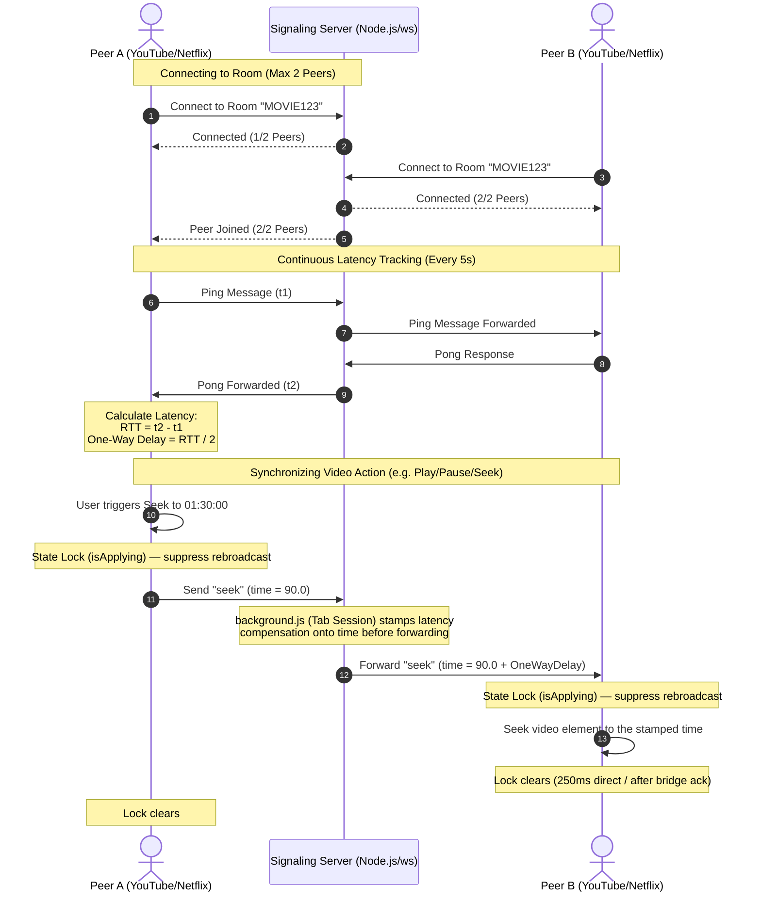
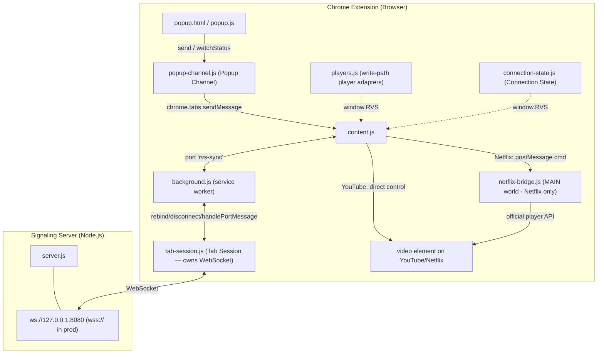

# Implementation & Architecture - Remote Video Synchronizer (RVS)

A lightweight Chrome Extension (Manifest V3) and a minimal WebSocket backend that
synchronize playback time, play/pause state, and speed of the native video
players on **YouTube** and **Netflix** in real time between two remote users.

This document is the design reference: the high-level architecture, the message
flow between components, and the per-file responsibilities. For local setup see
the [README](../README.md); for shipping to production see the
[Deployment Plan](deployment_plan.md). For the vocabulary used throughout (Tab
Session, Connection State, Popup Channel, etc.) see [CONTEXT.md](../CONTEXT.md).

---

## System Architecture

RVS has two components:

- **Chrome extension** (`extension/`) — injected into YouTube/Netflix tabs to
  capture local video events and apply remote sync commands.
- **Signaling server** (`server.js`) — a lightweight Node.js WebSocket relay that
  routes messages between exactly two peers per room.

Inside the extension, the WebSocket is **owned by the background service worker**
(`background.js`, via the [Tab Session](../CONTEXT.md#tab-session) module), not
the content script. This matters for two reasons: Netflix's page Content
Security Policy blocks `wss://` connections opened from a content script, and
the open port from the content script keeps the MV3 service worker alive for
the tab's lifetime.

The content-script bundle is split across three files, injected in this order:
`players.js` → `connection-state.js` → `content.js` (see
[Component Design](#component-design) below). On Netflix, writes go through a
MAIN-world bridge (`netflix-bridge.js`) that drives the official player API to
avoid tamper detection (error **M7375**) instead of touching the `<video>`
element directly.

The manifest declares **no `host_permissions`**, and `content_scripts.matches`
is `<all_urls>` for every injected file — some corporate/sandboxed Chrome
deployments (and non-Chromium engines like Orion) block extensions that
declare explicit host permissions for specific domains, which silently stops
the content script from ever loading there. Since injection is no longer
confined by the manifest, `content.js` and `netflix-bridge.js` each do their
own hostname check at the top and no-op entirely off YouTube/Netflix. Room
connection itself (CONNECT/DISCONNECT/GET_STATUS) works on **any** page —
only the video-specific integration is YouTube/Netflix-only (see
[ADR-0001](adr/0001-room-connection-host-agnostic.md)).

### Message Flow

```
popup.js ──Popup Channel──> content.js ──port──> background.js (Tab Session) ──WebSocket──> server.js ──> (peer) background.js ──port──> content.js
```

`popup.js` never touches `chrome.tabs` or `chrome.runtime.lastError` directly —
that's `popup-channel.js`'s job (see [Component Design](#component-design)).

### Peer Sync Sequence

The sequence below shows how two peers connect, track latency, and synchronize a
video action:


```mermaid
sequenceDiagram
    autonumber
    actor PeerA as Peer A (YouTube/Netflix)
    participant Server as Signaling Server (Node.js/ws)
    actor PeerB as Peer B (YouTube/Netflix)

    Note over PeerA, Server: Connecting to Room (Max 2 Peers)
    PeerA->>Server: Connect to Room "MOVIE123"
    Server-->>PeerA: Connected (1/2 Peers)
    PeerB->>Server: Connect to Room "MOVIE123"
    Server-->>PeerB: Connected (2/2 Peers)
    Server-->>PeerA: Peer Joined (2/2 Peers)

    Note over PeerA, PeerB: Continuous Latency Tracking (Every 5s)
    PeerA->>Server: Ping Message (t1)
    Server->>PeerB: Ping Message Forwarded
    PeerB->>Server: Pong Response
    Server->>PeerA: Pong Forwarded (t2)
    Note over PeerA: Calculate Latency:<br/>RTT = t2 - t1<br/>One-Way Delay = RTT / 2

    Note over PeerA, PeerB: Synchronizing Video Action (e.g. Play/Pause/Seek)
    PeerA->>PeerA: User triggers Seek to 01:30:00
    Note over PeerA: State Lock (isApplying) — suppress rebroadcast
    PeerA->>Server: Send "seek" (time = 90.0)
    Note over Server: background.js (Tab Session) stamps latency<br/>compensation onto time before forwarding
    Server->>PeerB: Forward "seek" (time = 90.0 + OneWayDelay)
    Note over PeerB: State Lock (isApplying) — suppress rebroadcast
    PeerB->>PeerB: Seek video element to the stamped time
    Note over PeerB: Lock clears (250ms direct / after bridge ack)
    Note over PeerA: Lock clears
```

### Component Diagram


```mermaid
graph TD
    subgraph "Signaling Server (Node.js)"
        S["server.js"]
        WS["ws://127.0.0.1:8080 (wss:// in prod)"]
    end
    subgraph "Chrome Extension (Browser)"
        P["popup.html / popup.js"]
        PC["popup-channel.js (Popup Channel)"]
        PL["players.js (write-path player adapters)"]
        CST["connection-state.js (Connection State)"]
        CS["content.js"]
        BG["background.js (service worker)"]
        TS["tab-session.js (Tab Session — owns WebSocket)"]
        NB["netflix-bridge.js (MAIN world · Netflix only)"]
        V["video element on YouTube/Netflix"]
    end

    S --- WS
    P -->|send / watchStatus| PC
    PC -->|chrome.tabs.sendMessage| CS
    PL -.->|window.RVS| CS
    CST -.->|window.RVS| CS
    CS <-->|port 'rvs-sync'| BG
    BG <-->|rebind/disconnect/handlePortMessage| TS
    TS <-->|WebSocket| WS
    CS -->|YouTube: direct control| V
    CS -->|Netflix: postMessage cmd| NB
    NB -->|official player API| V
```

---

## Component Design

### 1. Signaling Backend

A minimal server that pairs two WebSocket connections sharing a Room ID and relays
event payloads between them.

#### [`package.json`](../package.json)
- Declares the runtime dependency `ws`.
- Start script: `npm start` → `node server.js`.

#### [`server.js`](../server.js)
- Runs a WebSocket server, binding to `127.0.0.1:8080` by default (`HOST`/`PORT`
  env vars override for production).
- Holds rooms in-memory as a `Map<roomId, WebSocket[]>`, **max 2 peers per room**.
- On `join`, registers the socket in its room; blindly relays every other packet
  (`play`, `pause`, `seek`, `rate`, `media_info`, `p2p_ping`, `p2p_pong`) to the
  peer.
- Cleans up on disconnect and notifies the remaining peer.

### 2. Chrome Extension

#### [`extension/manifest.json`](../extension/manifest.json)
- Manifest V3. Requests only `activeTab` and `clipboardRead` — **no
  `host_permissions`**, and `content_scripts.matches` is `<all_urls>` (see
  [System Architecture](#system-architecture) above for why).
- Declares static `icons` (16/48/128) for `chrome://extensions`, the install
  dialog, etc. — separate from the toolbar/action icon, which is painted at
  runtime (see `background.js` below).
- Registers the popup action, the `players.js` → `connection-state.js` →
  `content.js` content-script bundle, and the Netflix-only MAIN-world
  `netflix-bridge.js`.
- The `version` field is the **single source of truth for releases** — see
  [CONTRIBUTION.md](../CONTRIBUTION.md#4-versioning--releasing).

#### [`extension/config.js`](../extension/config.js)
- Single point of configuration: `WS_SERVER_URL`. `ws://127.0.0.1:8080` for local
  dev, `wss://your-domain` for production. Loaded by `background.js` via
  `importScripts`.

#### [`extension/popup.html`](../extension/popup.html) / [`extension/popup.js`](../extension/popup.js)
- Dark-themed popup UI. Provides a Room ID input with **Generate** (random
  6-character ID), **Copy**, and **Paste** helpers, a Connect/Disconnect toggle,
  and live status / peer-count / RTT / "Now Watching" readouts.
- Talks to `content.js` only through `popup-channel.js` (below) — never touches
  `chrome.tabs` or `chrome.runtime.lastError` itself.
- The Room ID field auto-fills once per popup-open session (from the active
  room, or the stable per-tab suggestion `content.js` persists) and then locks —
  no further programmatic writes to the field for the rest of that session, so
  the 1s status poll never fights a manual edit.

#### [`extension/popup-channel.js`](../extension/popup-channel.js) — the **Popup Channel**
- `createPopupChannel()` wraps `chrome.tabs.query`/`chrome.tabs.sendMessage` and
  normalizes "no content script there" (`chrome.runtime.lastError`) to a single
  `callback(null)`.
- Owns the 1s `GET_STATUS` poll internally via `watchStatus(callback)`, so
  `popup.js` only ever calls `send(message, callback)` / `watchStatus(callback)`.
- Deliberately polling-only (no push-mode transport) — the only mechanism proven
  to work across engines, including Orion/iOS.

#### [`extension/background.js`](../extension/background.js) + [`extension/tab-session.js`](../extension/tab-session.js) — the **Tab Session**
- `background.js` is a thin dispatcher: `chrome.runtime.onConnect` looks up or
  creates a `TabSession` per `tabId` (`tabStates: Map<tabId, TabSession>`) and
  only ever calls its four-method interface — `rebind(port)`,
  `disconnect(deadPort, lastErrorMessage)`, `handlePortMessage(msg)`,
  `getStatus()`. It never touches a session's WebSocket, port, or room state
  directly.
- `tab-session.js` owns the actual `WebSocket` to the signaling server, the
  5-second latency ping loop, and room-membership state. It distinguishes a
  **real** disconnect from a **bfcache-driven** one (Chrome disconnects a
  content script's port the instant its page becomes back/forward-cache
  eligible, which happens on almost any navigation, well before the
  destination page's content script starts) — a bfcache disconnect keeps the
  session alive so the next port for that `tabId` rebinds onto it, instead of
  tearing down and racing a fresh WebSocket against the server's 2-peer room
  check.
- `background.js` also renders the colored toolbar icon (red/yellow/green) via
  `OffscreenCanvas` (`updateIcon`, injected into `createTabSession` as a
  dependency).

#### [`extension/players.js`](../extension/players.js)
- Exposes two **write-path player adapters** on `window.RVS`: a direct player
  (YouTube, writes `video.currentTime`/`.play()`/`.pause()` directly) and a
  bridge player (Netflix, posts commands to `netflix-bridge.js`). Both expose
  `apply(msg)` / `isApplying()` / `onVideoReady()`.
- Each adapter owns its own **State Lock** (`isApplying`) — see
  [Sync Mechanics](#sync-mechanics) below.

#### [`extension/connection-state.js`](../extension/connection-state.js) — the **Connection State**
- `createConnectionState()`, exposed on `window.RVS` alongside `players.js`'s
  factories (merging, not overwriting, since both load into the same
  content-script realm). `content.js`'s local mirror of the popup-facing
  connection status — `status`/`peersCount`/`oneWayLatency`/`peerMediaInfo` —
  behind `connect()`, `disconnect()`, `handleState(update)`,
  `handleLatencyUpdate(latency)`, `handleMediaInfo(update)`, `handleError()`,
  `getSnapshot()`. Not the same thing as a Tab Session: a Tab Session owns the
  actual WebSocket and is the source of truth; this is `content.js`'s derived
  view of it.

#### [`extension/content.js`](../extension/content.js)
- Injected on **every** page (`<all_urls>`), but the video-specific integration
  (site adapter, player, DOM `MutationObserver`) is gated to a YouTube/Netflix
  hostname check — CONNECT/DISCONNECT/GET_STATUS work regardless.
- Opens a `chrome.runtime.connect` port (name `rvs-sync`) to `background.js`.
  The port isn't a one-time `const` — a `connectPort()` function creates it and
  is called again whenever `port.onDisconnect` fires, or on `pageshow` with
  `event.persisted` (a same-tab bfcache restore resumes this exact script
  instance with its old, already-dead port). Every send goes through a
  `sendToPort(msg)` helper that catches a synchronous throw from a
  still-undetected-dead port and reconnects, instead of crashing the
  `chrome.runtime.onMessage` listener.
- Finds the `<video>` via a `MutationObserver` (the SPA injects it ~1–2s after
  load) and hands it to the direct player via a `getVideo` callback; captures
  native `play`/`pause`/`seeked`/`ratechange` events on both sites (reads are
  unchanged even on Netflix, where writes are bridge-only).
- **YouTube** uses the direct player. **Netflix** uses the bridge player, which
  posts commands to `netflix-bridge.js` via `window.postMessage`
  (`{ __rvs: 'cmd', ... }`) and waits for the bridge's `{ __rvs: 'ack', ... }`.

#### [`extension/netflix-bridge.js`](../extension/netflix-bridge.js)
- Runs in the page's **MAIN world** (Netflix only, `"world": "MAIN"` in the
  manifest) so it can reach
  `window.netflix.appContext.state.playerApp.getAPI().videoPlayer`.
- Drives the official player API (`play` / `pause` / `seek` / `setPlaybackRate`)
  and acks back, avoiding the M7375 tamper error that direct `<video>` writes
  trigger on Netflix.

---

## Sync Mechanics

### State Lock (Anti-Feedback)
Each player adapter (`players.js`) owns an internal `isApplying` flag: before
applying a remote command it sets the flag, and `content.js`'s event listeners
skip broadcasting while `player.isApplying()` is true, so the resulting
programmatic `play`/`pause`/`seeked` event isn't re-broadcast back to the peer.
The direct (YouTube) player clears the flag 250ms after applying via
`setTimeout`. The bridge (Netflix) player clears it ~300ms after the bridge's
`ack` arrives (with a 4.5s safety-net timeout), since the bridge applies
commands asynchronously.

### Latency Compensation
One-way latency is estimated as `RTT / 2` in `background.js` (`tab-session.js`)
from the periodic ping/pong. For incoming `play` and `seek` packets,
`tab-session.js` stamps the compensation onto `time`
(`data.time += oneWayLatency / 1000`) **before** forwarding to the
content-script port, so both player adapters apply the timestamp verbatim
(clamping only to the video duration). Centralizing it where latency is
measured keeps both player adapters free of timing math.

### Now Watching (Media Sharing)
`content.js` reads the current video's title (from the page DOM — no MAIN-world
bridge needed) and URL, and emits `media_info` to the peer on pairing and
whenever the local user navigates to a different video. A `lastSentMediaInfo`
cache (`{ url, title }`, compared field-by-field) de-dupes so unchanged state
isn't re-broadcast. The popup shows the **peer's** current video
(`peerMediaInfo`, from `connection-state.js`) and turns its URL into a
clickable link **only** after validating it is an `http(s)` YouTube/Netflix URL
— an untrusted scheme (e.g. `javascript:`) is shown as plain text, never
linked. Links are built with `createElement`/`textContent` (no `innerHTML`).
Clicking the link navigates the **current** tab (via `chrome.tabs.update`)
rather than opening a new window, so a user can "join" the peer's video in
place.

### Session Resume
"Joining" the peer's video is a full-page navigation, which tears down and
re-injects the content script (a fresh `port`). To make this seamless,
`content.js` persists the active room in **`sessionStorage`**
(`__rvs_active_room`) and auto-rejoins on load via `connectPort()`'s resume
step. `sessionStorage` is per-tab and same-origin, so a brand-new tab starts
disconnected rather than every YouTube/Netflix tab auto-joining the room. The
key is set on connect, and cleared on an explicit disconnect or an actionable
server error (e.g. room full) so a reload doesn't loop trying to rejoin; a
*silent* connection-level error (server down) keeps it, so a later reload can
retry.

This same resume step also covers **recovering from an unexpected port
disconnect** that isn't a page navigation at all — a same-tab bfcache restore,
or the service worker being restarted by Chrome — since from `content.js`'s
side the two cases look identical: no live port, and `sessionStorage` says
which room (if any) it should be in. See `connectPort()` in
[Component Design](#component-design) above.

### Same-Video Gating
Playback sync is meaningful only when both peers are on the same video, so
`content.js` suppresses `play`/`pause`/`seek`/`rate` — both outgoing and incoming —
whenever it can confirm the peer is on a *different* video. Comparison uses a
canonical video ID (`getVideoId`: the YouTube `v`/`shorts`/`youtu.be` id or the
Netflix `/watch/<id>`), so timestamps, playlist, and other query noise don't read
as a different video. When the peer's video is unknown (pre-handshake) or a URL
can't be parsed, sync is **not** blocked. `media_info` and latency pings continue
to flow regardless, so the moment one peer navigates to match the other, sync
resumes automatically.

---

## Sync Packet Reference

All packets are JSON.

**Client-originated:**
- `{ action: 'join', room: string }` — sent on connect.
- `{ action: 'play' | 'pause' | 'seek', time: number }` — video events.
- `{ action: 'rate', rate: number }` — playback speed change.
- `{ action: 'media_info', title: string, url: string }` — the sender's current
  video, for the "Now Watching" panel (sent on pairing and on navigation).
- `{ action: 'p2p_ping', timestamp: number }` — latency probe (every 5s with 2 peers).
- `{ action: 'p2p_pong', timestamp: number }` — echoed back by the receiver.

**Server-originated** (relayed by `server.js` to `background.js`, then by
`tab-session.js` to the content-script port):
- `{ action: 'state', status: 'connected' | 'peer_disconnected', peersCount: number }`
  — enriched with `roomId` by `tab-session.js` before it reaches `content.js`,
  since the server's own packet doesn't carry one.
- `{ action: 'error', message: string, silent?: boolean }`
- `{ action: 'latency_update', latency: number }` — emitted by `tab-session.js`
  after each `p2p_pong`, not relayed from the server.

---

## Verification Plan

Verification is performed by loading the unpacked extension in Chrome — see the
[README → How to Test and Use](../README.md#-how-to-test-and-use) for the
step-by-step manual run, and [CONTRIBUTION.md](../CONTRIBUTION.md#5-before-you-open-a-pr--checklist)
for the pre-PR checklist.

### Automated Server & Port Verification
- Start the server on `127.0.0.1:8080` and confirm it binds and runs locally.

### Security Review
- **Sanitization**: validate Room ID format before use.
- **Port binding**: the server binds to `127.0.0.1` by default to prevent exposure
  during local testing.
- **No `innerHTML`**: all DOM updates use `textContent` / `createElement`.
